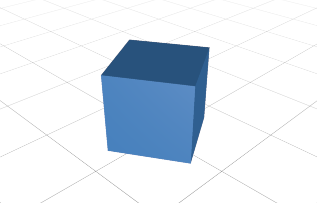

# Pygfx demo



## Getting Started

If you need to, [install a recent version of pixi](https://pixi.sh/latest/#installation).

Then, in the root folder of this project, execute the command: 

```bash
pixi run demo
```

## Demos

Type 

```bash
pixi run
```

to get a list of all available demos, then execute

```bash
pixi run DEMO_NAME
```

to run it.
